<div align="center">

<!-- HEADER -->


<br>

<!-- Typing SVG — two separate lines -->
<a href="https://github.com/HanielCota">
  
</a>
<br>
<a href="https://github.com/HanielCota">
  
</a>

<br>

<a href="mailto:beedfialho@gmail.com"></a>
<a href="https://linkedin.com/in/hanielfialho"></a>
<a href="https://www.youtube.com/@HanielFialho"></a>
<a href="https://twitter.com/PrazerBeeD"></a>

</div>

<br>

<!-- ═══════════════════════════════════════════════ -->
<!-- THE JOURNEY — SVG TIMELINE                      -->
<!-- ═══════════════════════════════════════════════ -->

<div align="center">

<!-- 
  ⚠️ IMPORTANTE: Coloque o arquivo timeline.svg na raiz do repo.
  O caminho abaixo assume que está em: HanielCota/HanielCota/timeline.svg
-->


</div>

<br>

<!-- ═══════════════════════════════════════════════ -->
<!-- TECH STACK                                      -->
<!-- ═══════════════════════════════════════════════ -->

<div align="center">

<h2>⚡ o arsenal</h2>
<sub>as ferramentas que uso pra transformar ideia em produto</sub>

<br><br>

<details open>
<summary><b>🎨 frontend — onde o pixel encontra a lógica</b></summary>
<br>

</details>

<details open>
<summary><b>⚙️ backend — onde a mágica acontece</b></summary>
<br>

</details>

<details open>
<summary><b>🛠️ tools & languages — o canivete suíço</b></summary>
<br>

</details>

<details open>
<summary><b>🤖 ai & dev tools — o multiplicador de força</b></summary>
<br>


<br>


</details>

</div>

<br>

<!-- ═══════════════════════════════════════════════ -->
<!-- PROJECTS                                        -->
<!-- ═══════════════════════════════════════════════ -->

<div align="center">

<h2>🏗️ o que estou construindo</h2>

<br>

<a href="https://ankares.com">

</a>
&nbsp;&nbsp;
<a href="https://floruit.com.br">

</a>
&nbsp;&nbsp;
<a href="https://github.com/HanielCota/FialhoClean">

</a>

</div>

<br>

<!-- ═══════════════════════════════════════════════ -->
<!-- STATS                                           -->
<!-- ═══════════════════════════════════════════════ -->

<div align="center">

<h2>📊 os números</h2>

<br>


&nbsp;


<br>


<br>


</div>

<br>

<!-- ═══════════════════════════════════════════════ -->
<!-- CURRENTLY                                       -->
<!-- ═══════════════════════════════════════════════ -->

<div align="center">

<h2>🎯 agora</h2>

<br>

```
  ╔══════════════════════════════════════════════════════════╗
  ║                                                          ║
  ║   🤖  explorando IA no desenvolvimento                   ║
  ║   📚  estudando direito (sim, código E lei)              ║
  ║   🏋️  treinando pesado                                   ║
  ║   ☕  movido a café duplo                                 ║
  ║   🧩  resolvendo problemas que ninguém pediu             ║
  ║                                                          ║
  ╚══════════════════════════════════════════════════════════╝
```

</div>

<br>

<!-- ═══════════════════════════════════════════════ -->
<!-- SNAKE ANIMATION                                 -->
<!-- ═══════════════════════════════════════════════ -->

<div align="center">

<picture>
  <source media="(prefers-color-scheme: dark)" srcset="https://raw.githubusercontent.com/HanielCota/HanielCota/output/github-snake-dark.svg" />
  <source media="(prefers-color-scheme: light)" srcset="https://raw.githubusercontent.com/HanielCota/HanielCota/output/github-snake.svg" />
  
</picture>

</div>

<br>

<!-- ═══════════════════════════════════════════════ -->
<!-- FOOTER                                          -->
<!-- ═══════════════════════════════════════════════ -->

<div align="center">


<br><br>

```
"a curiosidade que me fez abrir o eclipse em 2014
 é a mesma que me faz estudar ia em 2026."
```

<br>


<br><br>


</div>
